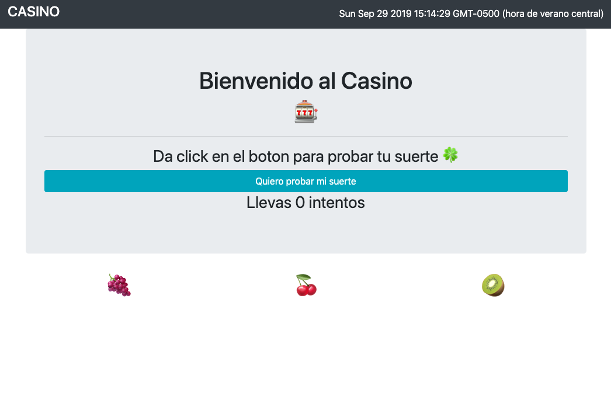
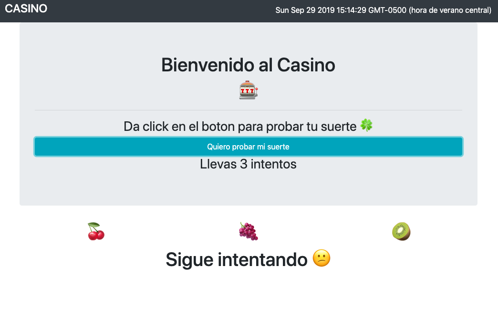
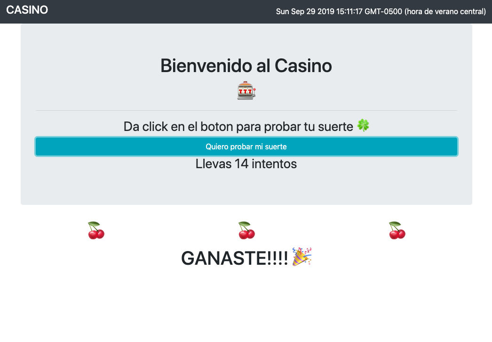

# Casino

This is a mock up of a casino machine built with React CDN and bootstrap.

It was built to get to know how to pass props and events from child o parent components and viceversa.

You can clone the project and serve it directly with visual studio code live server or use a python server.

This is how it looks like when playing:

